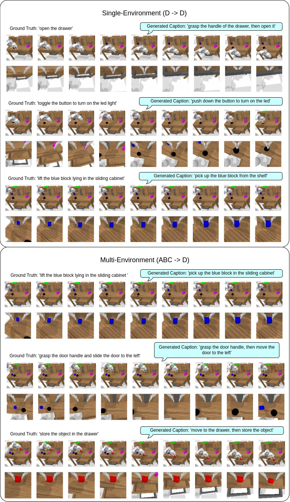

# Calvin + skillGPT

 This code uses models from the skillGPT repository: 
  <a target="_blank" href="https://github.com/krishanrana/skillGPT/tree/distributional_SkillGPT">skillGPT reposository</a>

 The repository has been modified to allow for training on the CALVIN dataset.

 The CALVIN dataset can be found and downloaded from: 
  <a target="_blank" href="https://github.com/mees/calvin/tree/main/dataset">CALVIN Datasets</a>

## Setup
To create a conda enviornment to run the code, follow these steps:

* conda create -n calvcapenv python=3.11.4
* conda activate calvcapenv
* pip install -r requirements.txt

## Training and Evaluation

### Pre-requirements: 

 Download the CALVIN dataset you want to train on:
  <a target="_blank" href="https://github.com/mees/calvin/tree/main/dataset">CALVIN Datasets</a>

Parse the CALVIN dataset using: `parse_dataset.py --env d` or `parse_dataset.py --env abc_d`
* parsing requires: <a target="_blank" href="https://github.com/facebookresearch/r3m">r3m</a> in the conda enviornment (should be added on pip install)

ensure your `config.py` variables point to the correct datasets

### Training and Evaluation: 

To train and evaluate the captioning model 2 juypter notebooks are provided:

* `captioning.ipynb` to train the d_d dataset or sequentially train the abc_d dataset 
* `captioning.ipynb` also contains model evaluation towards the bottom of the notebook
* `captioning_ABC_D.ipynb` to train the abc_d dataset simultianiously on all three training enviornments

 pre-trained checkpoints can be downloaded from
  <a target="_blank" href="https://uni-bielefeld.sciebo.de/s/g8cqCJbzM2YWBDh">skillGPT CALVIN checkpoints</a>

## Visulizations

* `visualizations.ipynb` can be used to generate various visualizations of the CALVIN dataset
* results of these can be found in `captioning/visualizations` 

## Results
Results of losses of different models can be found in `captioning/results`

## Behavior Generation
There was an attempt made to train the behavior generation auxillary task from the CLASP model on the CALVIN dataset
* This model is broken and doesn't provide usefull results
* `behavior_cloning.ipynb` trains the model
* `evaluate_bc.py` generates actions given a input caption (this requires installation of the CALVIN env: <a target="_blank" href="https://github.com/mees/calvin_env/tree/1431a46bd36bde5903fb6345e68b5ccc30def666">calvin_env</a> ) 

## Examples

  

